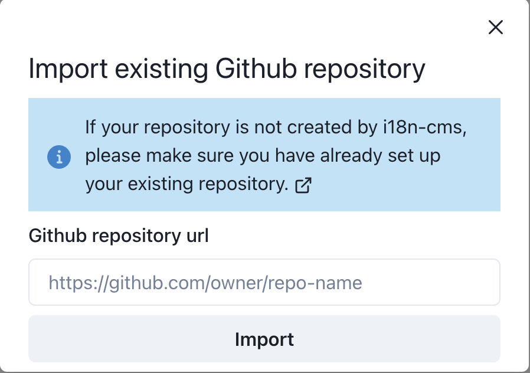

# Import existing repository

## Setup your existing repository

If your repository is not created by i18n-cms, please make sure you already setup your existing repository.

Add `.18n-cms/config.json` to your repository. Read more about [how to setup `config.json`](/docs/configuration)

## Import you existing repository by github url

Please make sure you have push permissions to the repository
